# Git-Node

## 新建仓库

```cmd
mkdir learn-git
git init
\rm -rf .git #强制删除git仓库
git init my-repo #指定子文件夹目录名称并生成git目录
```


## 工作区域和状态

三个区域

* 工作区域：git所在目录
* 暂存区（索引区）：用于存放即将提交的临时存储区
* 本地仓库：git存储代码和版本信息的主要位置


四种文件

* 未跟踪
* 未修改
* 已修改
* 已暂存

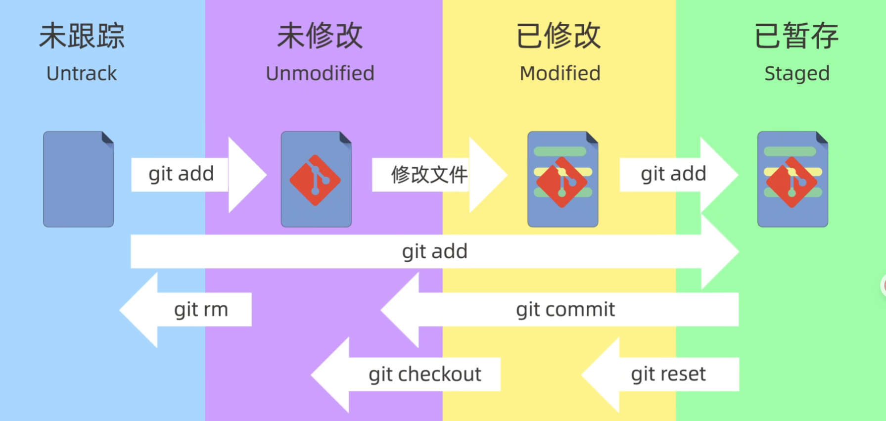

## 添加和提交文件

``` cmd
echo "这是第一个文件">file.txt #linux下直接在命令行创建和修改文件
cat file1.txt #查看文件内容
git status #查看状态
```

截图中的file1.txt还是未被跟踪的状态

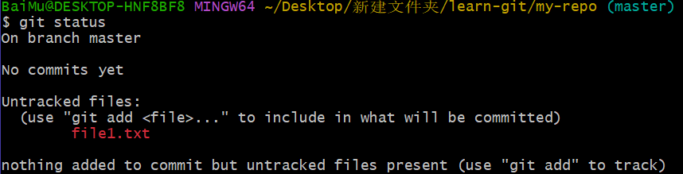

```cmd
git add file1.txt
git status
```

现在文件已经添加到了暂存区

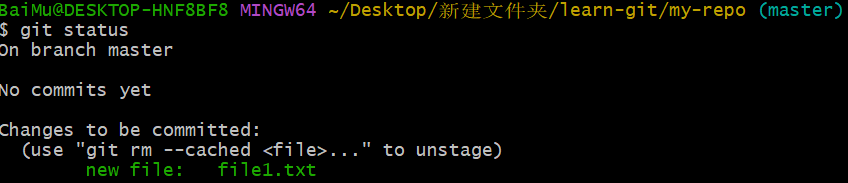
```cmd
git rm --cached file1.txt
git status
```

现在文件又回到未跟踪的状态

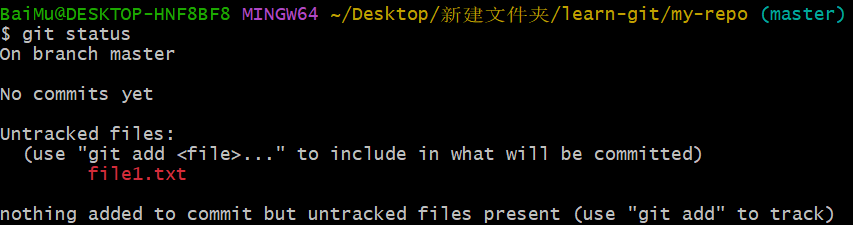

```cmd
echo "test">file.sh
git add *.txt ##将所有以.txt为后缀的文件提交到暂存区里
git status
```

当所有文件都存到仓库里边后，git status会显示如下。

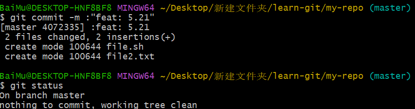

```cmd
git log
git log --oneline
```

可以使用git log命令查看提交记录。

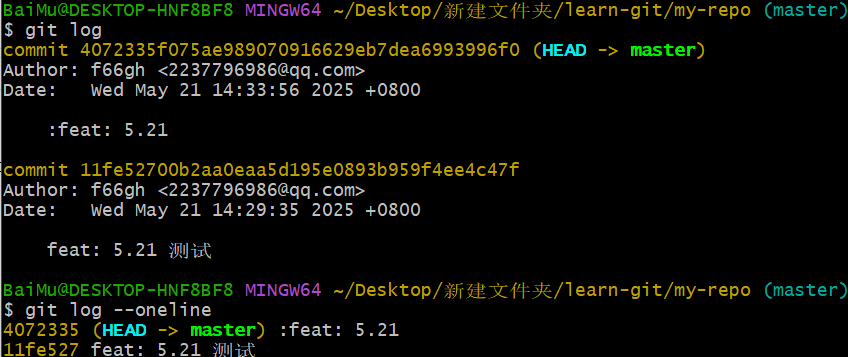

## git reset

用于回退版本

```cmd
git reset --soft
git reset --hard
git reset --mixed
```

* soft：工作区和暂存区都不会清空
* hard：工作区和暂存区都会被清空
* mixed：工作区不会清空，但暂存区会被清空

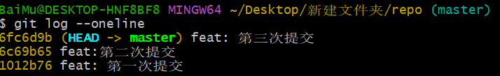

先依次提交三个文件，然后再复制三份文件夹

```cmd
cp -rf repo repo-xxx	
```

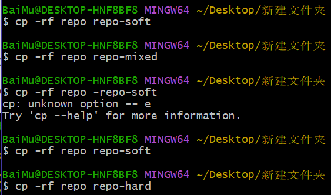

```cmd
git log --oneline
git reset --soft 6c69b65 #加上回退的版本号
git lof --oneline
```

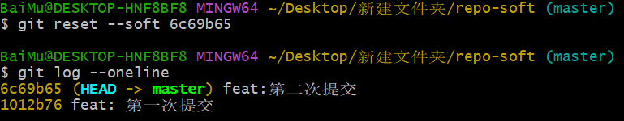

```cmd
git ls-files #查看暂存区的内容
```

回退到第二次提交的状态，此时暂存区和工作区的文件都存在，并且第三个文件未被提交

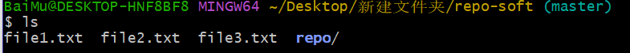

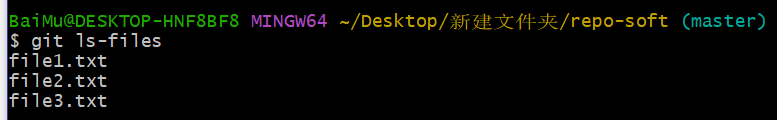

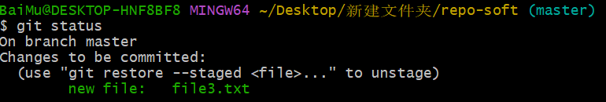

如下图所示，hard参数回退到第二个版本导致file3再工作区和暂存区都被删了

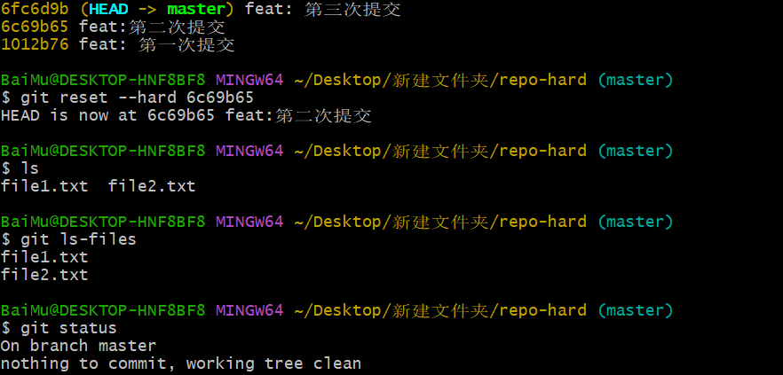

如下图所示，不加参数只写HEAD^是mixed回退，工作区保留，暂存区删除

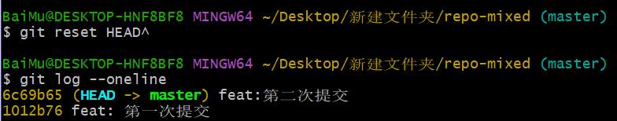

**soft和mixed主要用于当有多个版本需要合并成一次提交**

若不小心用hard删除了本地的文件，可以使用reset回溯操作

```cmd
git reflog ##找到操作记录
git reset --hard ##回退到对应的操作之前的状态
```

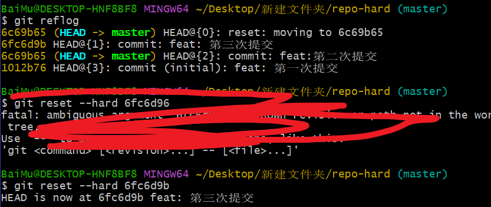

## git diff

* 查看工作区，暂存区和仓库区之间的差异
* 查看不同版本之间的差异
* 查看不同分支之间的差异

git diff后面什么都不加的话默认比较的是工作区和暂存区之间的差异内容

红字表示删除内容，绿字表示添加内容

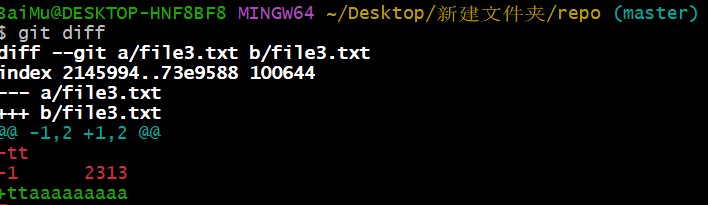

```CMD
git diff HEAD #查看暂存区和仓库之间的差异
git diff --chached #比较暂存区和仓库之间的差异
```

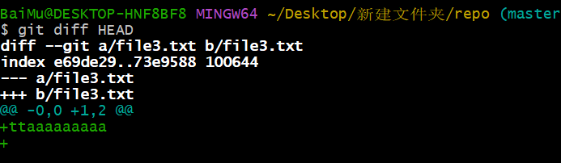

还可以通过ID比较不同版本之间的内容

```cmd
 git diff 1012b76 eb6293a
 git diff 1012b76 HEAD #HEAD表示最新提交的版本
```

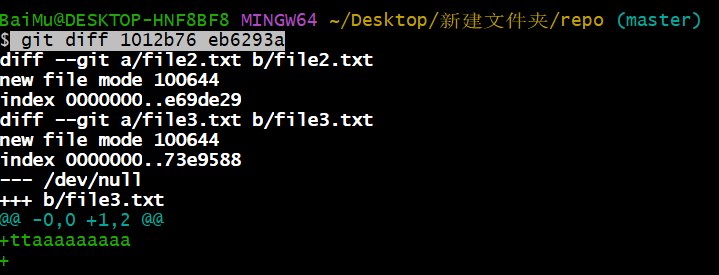

可以使用如下方法快速比较新版本和上一个版本的不同

```cmd
git diff HEAD~ HEAD #head~表示最新版本的上一个版本
git diff HEAD^ HEAD #同上
git diff HEAD~2 HEAD #表示比较之前两个版本
git diff HEAD~3 HEAD file3.txt #也可以只显示某一个文件的差异内容
```

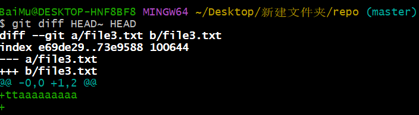

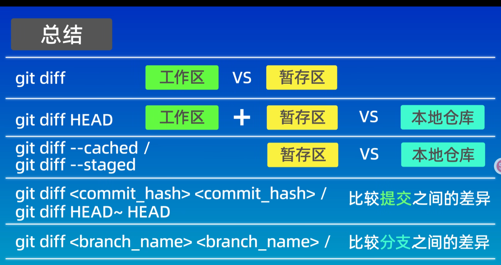

## git rm

```cmd
rm file1.txt #在工作区删除文件
git ls-files #查看暂存区中的内容
```

删除完file1.txt之后提示已删除，然后再add

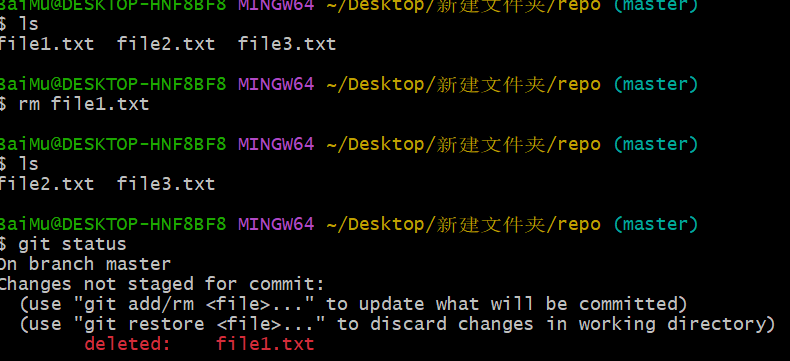

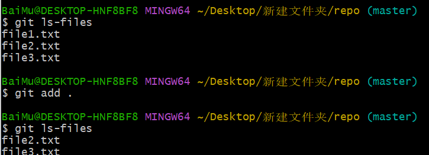

```cmd
git rm file2.txt
```

直接用git rm 同时删除工作区和暂存区中的文件

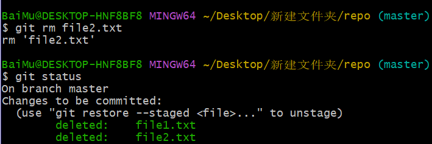

## .gitignore

在这个文件中列出需要忽略的文件，这些文件就不会提交到仓库中


先创建两个log文件

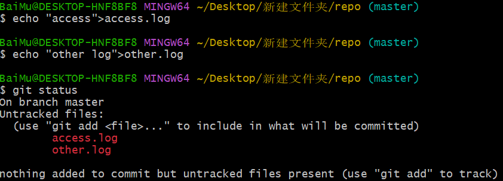

```cmd
echo access.log > .gitignore
cat .gitignore
```

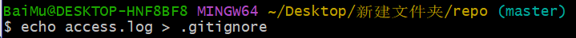

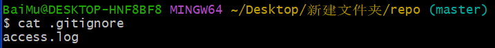

在将access.log添加到gitignore之后，git已经忽略这个文件

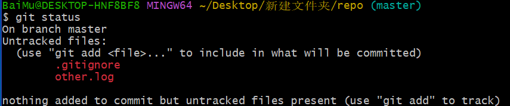

提交到仓库后没有access.log

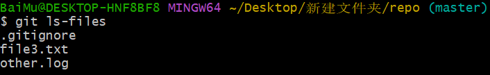

可以手动修改.gitignore中的内容，添加*.log，这样可以忽略所有类型的log文件

再次添加log文件后直接忽略

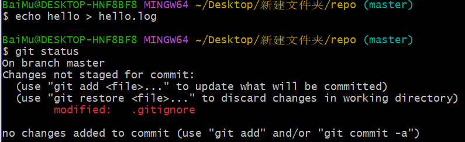

**注意此时other.log已经在仓库中，若在本地区修改之后还是可以正常提交至仓库。需要将other.log从版本库中删掉**

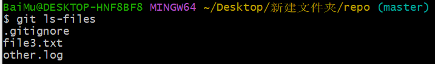

```cmd
git rm --cached other.log #只删除仓库中的log而不删除工作区的log，不加cached直接删除工作区的文件
```

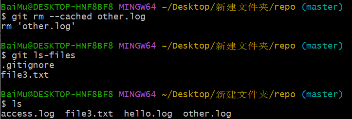

下图是先添加一个文件夹

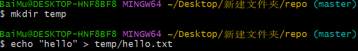

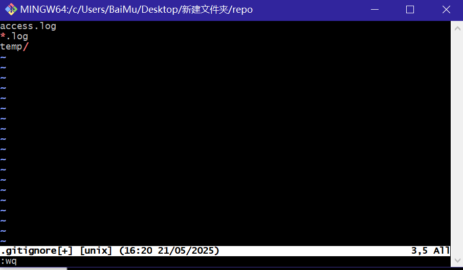

在.gitignore中添加temp文件夹（注意以斜线结尾），这样就忽略了

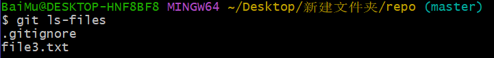


## 关联本地仓库和远程仓库

```cmd
git remote add origin git@github.com:f66gh/TEST.git #第一个origin为仓库别称，第二个为线上仓库地址
git branch -M main #指定分支名称为main
git push -u origin master:main # -u表示上传，第一个master是本地的分支，第二个main是线上仓库的分支
```

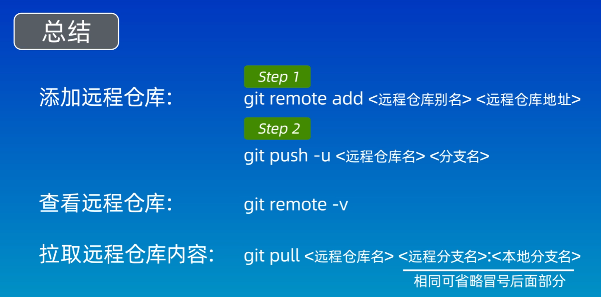

可以使用git remote add 命令同时关联github和gitlab两个仓库

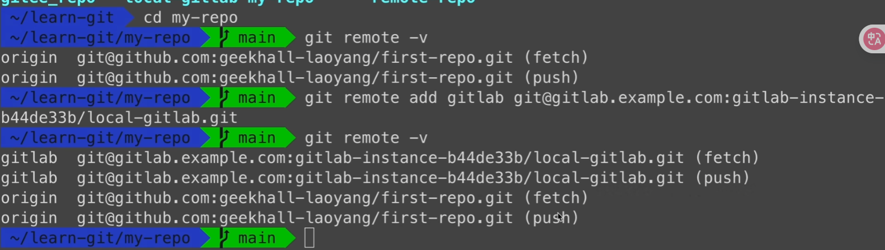

## VSCode

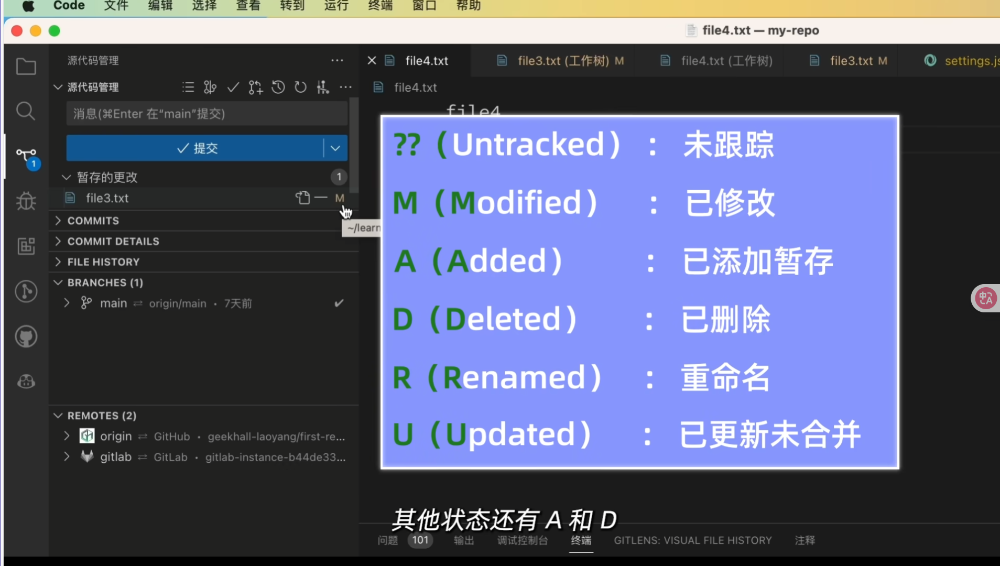

## 分支

```cmd
git branch #查看当前所有分支
git branch dev #新建dev分支	
git checkout dev #切换到dev分支
git switch master #切换到master分支
```

master分支工作区复制到dev上，dev工作区有新的文件

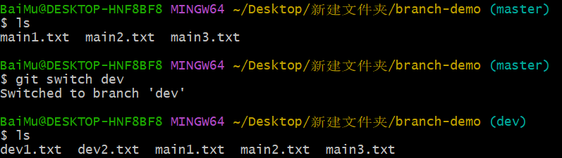

```cmd
git merge dev #将dev分支合并到当前分支（master）
git branch -d dev #删除dev分支，且dev是已经被合并的分支
git branch -D dev #强制删除dev分支
git checkout -b dev 61aaa56 #从dev2这个状态新建一个分支（和恢复指定状态的分支一个意思）
```

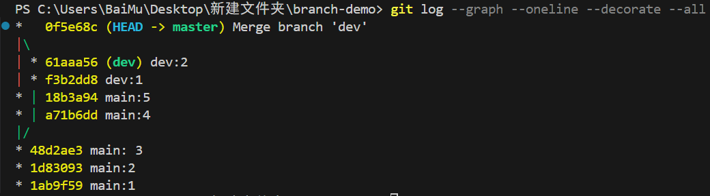

## 冲突

```cmd
git commit -a -m "feat:1" #对已存在的文件可以同时进行提交至暂存区和仓库
git commit -am "feat: 1" #上述命令行可简写为这个
```

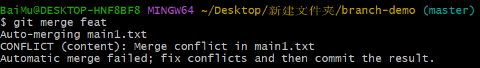

可以用status查看当前状态，也可以用diff查看两个不同分支的不一致情况

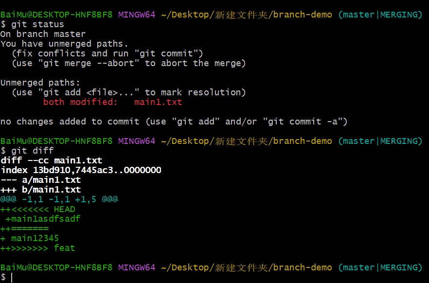

应当手动修改冲突文件并再次提交

```cmd
git merge --abort #当合并出现冲突时可以终止合并
```

## rebase

如图所示，执行rebase之后所有分支都会合并成一个，从分支的最晚公共结点嫁接到rebase后面的分支

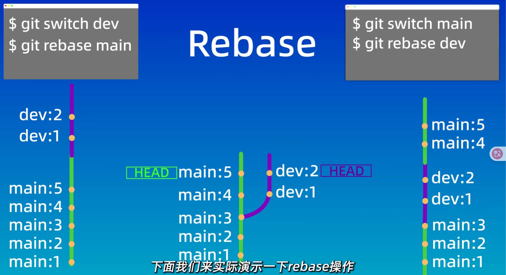

```cmd
alias graph="git log --oneline --graph --decorate --all" #alias是别名指令
```

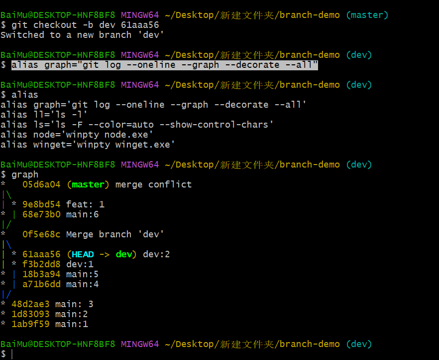

```cmd
git reset --hard #将仓库版本回退到指定节点
```

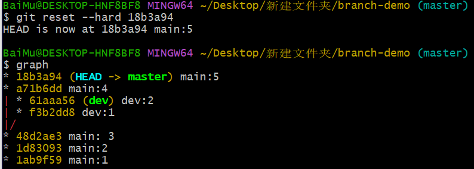

```cmd
cp -rf branch-demo rebase1 # 复制文件
cp -rf branch-demo rebase2
git rebase master #将当前分支变基到master
```

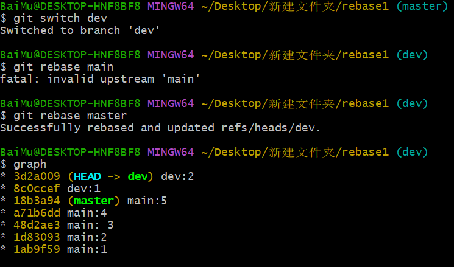

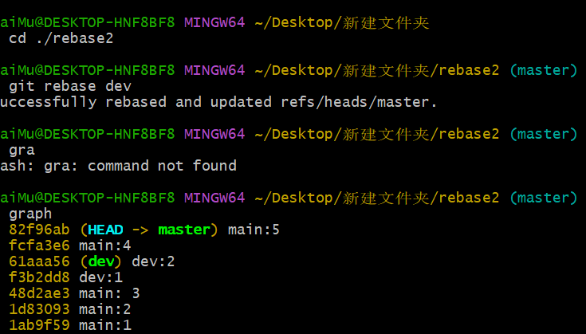


 ## 工作流模型

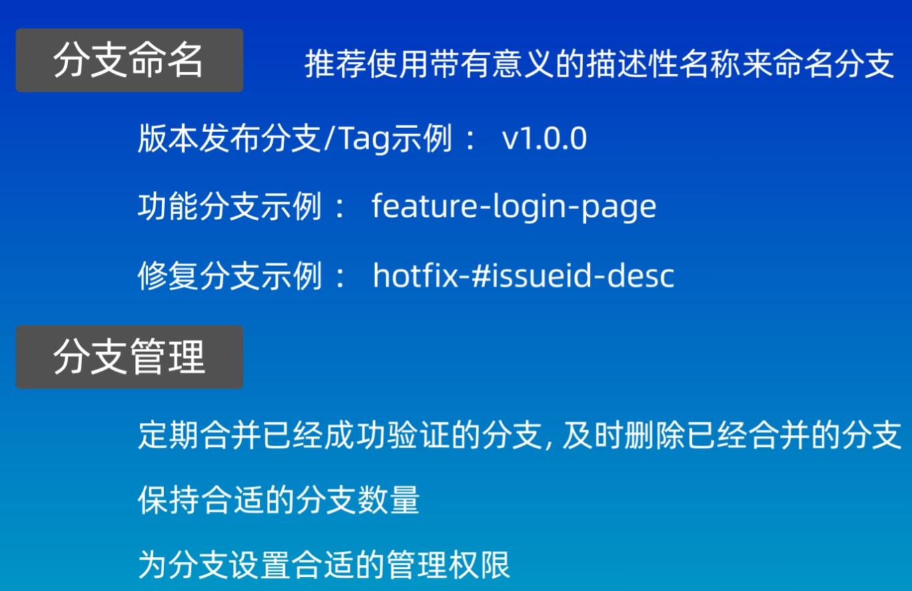

